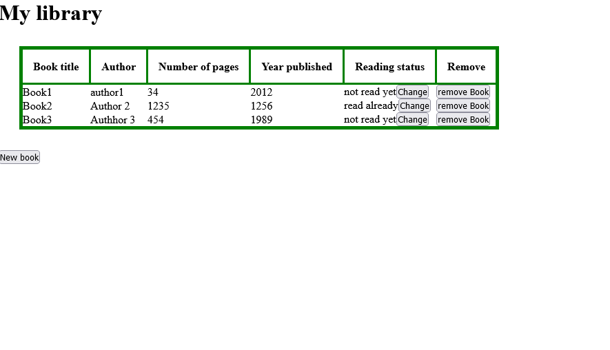

# Library

> In this project I created a table for storing my books.




## Built With

- HTML 5
- JavaScript

## Live Demo

[Live Demo Link](https://shinobiwarior.github.io/Library/)


## Getting Started

To get a local copy up and running follow these simple example steps.

### Prerequisites

`No prerequisites`

### Setup

Clone the repository with:

```
git clone https://github.com/ShinobiWarior/Library.git
```
or download [ZIP file](https://github.com/ShinobiWarior/Library/archive/refs/heads/library-feature.zip)


To run it online just click on [Live Demo Link](https://shinobiwarior.github.io/Library/)


## Author

👤👤 **Aleksandar Ivezic**

- GitHub: [@Aleksandar Ivezic](https://github.com/ShinobiWarior)
- Twitter: [@AIvezic](https://twitter.com/AIvezic)
- LinkedIn: [Aleksandar Ivezic](https://www.linkedin.com/in/aleksandar-ivezic/)

## 🤝 Contributing

Contributions, issues, and feature requests are welcome!

Feel free to check the [issues page](https://github.com/ShinobiWarior/Library/issues/).

## Show your support

Give a ⭐️ if you like this project!

## Acknowledgments

- This project was Inspired by [Microverse](https://www.microverse.org/?grsf=w9rx3c)

## 📝 License

This project is [MIT](lic.url) licensed.
